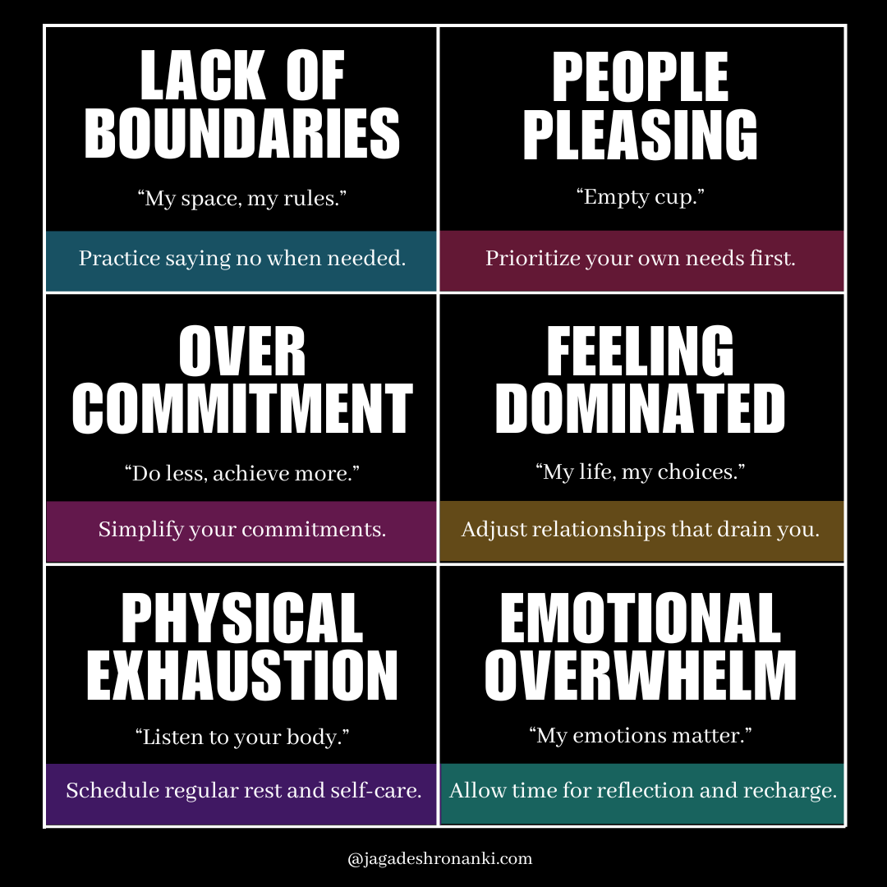

Last week, I shared thoughts on how our [interactions with others have shifted over time](https://jagadeshronanki.com/letters/the-weight-of-expectations), leading to feelings of anxiety and overwhelm. But there’s a lingering question that keeps coming back: **Why do I struggle with simple things that others seem to handle effortlessly?**

I see so many incredible people around me:

- They travel extensively.
- They explore new places.
- They enjoy movies.
- They cherish time with family.
- They meet new people.

When asked, “What’s new with you?” I often respond with a shrug and a half-hearted smile, “Not much, just the usual stuff.”

I feel trapped in a dark mental space that dims my excitement for life. 

Years of questioning how I got here—disconnected from joy and avoiding responsibilities—have shaped my identity. I find myself morphing into different versions of myself, depending on the situation.

The answer to my struggles often points to **the people and situations around me.** Research shows that our social environments significantly impact our mental health; being around positive influences fosters emotional well-being.

I had a happy childhood, but I also experienced pain that I concealed. I accepted the control of others over my actions, believing it was a necessary compromise for friendship.

Then came a pivotal moment: I withdrew from those friendships and isolated myself. That’s when negative thoughts began to creep in.

Years have passed, yet my focus remains on human behavior.

Recently, I attended a lecture by [Aman Girdhar](https://linkedin.com/in/amangirdhar), a facilitator in behavioral learning and development skills. I didn’t know what to expect, but it felt like he was speaking directly to me.

His soothing voice evoked memories, and I was fully engaged with his words—insights I had yearned for over my 23 years.

At the session's end, I heard some voices dismissing the value of what we learned:

“Why do we need this?”

“Don’t listen to these guys; they’ll just complicate your life.”

While I respect their opinions, I worry for those lacking empathy for such insights. Many struggle with assertiveness and boundaries, often unaware of how their behaviors impact others.

Some individuals dominate conversations, leaving others feeling their needs don’t matter.

Whether or not you relate to this, it’s vital to recognize how you might unintentionally add to someone else’s emotional burden.

What We’ll Explore&nbsp;&nbsp;↩

- The hidden ways our behaviors affect those around us and the importance of recognizing these patterns.
- The difference between assertiveness and dominance—empowering you to communicate your needs while respecting others.
- A framework for breaking free from toxic cycles, allowing you to cultivate healthier and more fulfilling connections (The Grid for Breaking Free).

For those feeling the weight of these dynamics:

- You can change your interactions.
- You can gain emotional clarity and mutual respect.
- You have the chance to create relationships that uplift you rather than drain you.

The first step toward change is recognizing the behaviors that hold you back.

---

## The Hidden Voice: Don’t Let It Go Unnoticed

> “The unexamined life is not worth living.” — Socrates

Life can feel complex, especially in understanding human behavior. We’re surrounded by individuals with diverse beliefs and patterns. Yet, one truth emerges: the difference between those who control others and those whose needs overshadow their own often lies in the **expression of thoughts**.

The First Incident&nbsp;&nbsp;↩

I remember a moment from my school days that left me feeling suppressed. A peer bullied me for my better grades. It may seem trivial, but it had a lasting impact. I confronted him, and while he apologized, he continued the behavior later.

Thoughts raced through my mind:

- Why did he do it again?
- Should I react the same way?
- Is this how people truly understand each other?
- Do my words even matter?
- Why do I keep taking a step back from expressing my opinion?

You may have faced similar moments where you felt silenced. What thoughts run through your mind then? Are you afraid of judgment? Do you lack the courage to stand up for yourself?

Understanding Assertiveness&nbsp;&nbsp;↩

Assertiveness is the ability to express your thoughts, feelings, and needs directly and honestly while respecting others.

Improved communication leads to better boundary-setting.

Why do you struggle with assertiveness? Fear of judgment or rejection often plays a role. You may worry about upsetting others or damaging relationships. But when you allow others to dominate your choices, you risk losing your voice.

In these situations, stay calm and listen to your inner voice. 

Your inner voice consists of thoughts and feelings that arise from within. It can be supportive, encouraging you to pursue your goals, or critical, undermining your confidence.

Conversely, outer voices represent the opinions and pressures from the world around you. When influenced by these outer voices, problems arise. 

Once this cycle begins, it can persist for years, sometimes for life. Daily, we’re bombarded with messages questioning our thoughts. 

Societal norms dictate what’s considered “normal” or “acceptable.” While helping others is admirable, constant self-sacrifice impacts each individual on a personal level.

The Consequences of Suppression&nbsp;&nbsp;↩

Continuous suppression can lead to habitual compliance. You may prioritize others’ opinions over your own, resulting in a cycle of self-neglect.

The solution lies in quieting the noise around you to access your inner voice clearly. Self-reflection is crucial for recognizing when you override your inner voice.

Journaling can be an effective tool for this process. Writing down your thoughts creates space for introspection and clarity. Research shows that journaling helps individuals organize their thoughts and emotions, improving decision-making.

By reflecting on your experiences—both positive and negative—you begin to identify behavioral patterns. This awareness is what you’ve been missing for so long.

---

## Finding Balance Between Inner and Outer Voices

I started writing letters as my public journal, which you’re reading now. Initially filled with worries, I hesitated to share certain events and often questioned what to post next. My mind was overwhelmed with lingering thoughts.

Then I began to introspect honestly. One thought nagged at me: **Do people think I’m selfish?**

If I voice my feelings or point out others’ actions, they might play the victim—claiming they never meant it that way.

As Marcus Aurelius said: _“You have power over your mind—not outside events. Realize this, and you will find strength.”_

This quote reminds us that while we can’t control external circumstances, we can choose how we respond. I stopped worrying about what others thought of me. Instead, I empathized with them while recognizing their lack of empathy toward me—it’s okay to point that out.

Striking a balance between your inner voice and external influences is essential for personal growth and well-being. It involves evaluating which outer voices resonate with your values and which ones to disregard.

By journaling regularly, you can find **emotional regulation and clarity** while understanding the patterns and triggers that stress you out. This practice can lead to:

- **Reduced anxiety**
- **Improved self-awareness**
- **Better physical health**

Ultimately, it leaves a positive impact on your life.

If you’re ready to try journaling, here are some tips to get started:

- **Set Aside Time**: Choose a specific time each day to write—maybe in the morning with coffee or at night before bed.
- **Start Small**: You don’t need to write pages every day. Start with just five minutes or a few sentences.
- **Use Prompts**: If unsure what to write about, use prompts like “Today I felt…” or “I’m grateful for…” to guide your thoughts.
- **Be Honest**: Write freely without holding back. This is your space, so let your true feelings flow.
- **Focus on Yourself**: Express yourself without considering others’ opinions or feelings.

“Grab a notebook and pen to help you feel more in control of your emotions and more connected to yourself.”

---

## Practice Assertiveness

Learning to assert yourself is the next step in changing your life dynamics. Here are some strategies:

- **Use “I” Statements**: Communicate your feelings without blaming others. For example, say, “I feel overwhelmed when I take on too many tasks” instead of “You always give me too much work.”
- **Be Direct**: Clearly state your needs. For instance, “I need some time alone after work to recharge.”
- **Practice Saying No**: It’s okay to decline requests that infringe on your time or well-being. Start small by saying no in low-stakes situations.

To practice assertiveness effectively, recognize the toxic behaviors that may influence your relationships.

Recognizing Toxic Behaviors&nbsp;&nbsp;↩

Some individuals won’t care about your well-being. They exhibit toxic behaviors—those who disregard others’ needs and dominate conversations or decisions.

So, what exactly are toxic behaviors?

- **Manipulation**: Using guilt or pressure to get what they want.
- **Gaslighting**: Making someone doubt their own reality or feelings.
- **Constant Criticism**: Regularly belittling or undermining others.
- **Lack of Accountability**: Refusing to take responsibility for their actions.
- **Boundary Violations**: Disregarding others’ limits and needs.

Establishing personal boundaries is crucial for maintaining mental health and well-being. Boundaries define where one person ends and another begins. When boundaries aren’t respected, it can lead to feeling overwhelmed or dominated.

I remember struggling to set boundaries with a friend who expected me to drop everything for them. Initially, I felt honored they wanted to spend time with me, but over time, it became exhausting. I realized I was sacrificing my own needs for their sake.

With all my life experiences, I advise you to not hesitate in distancing yourself from those who don’t value your well-being.

---

## The Grid for Breaking Free

  

Imagine juggling demands without feeling empowered to say, “No, that doesn’t work for me.” This is where people-pleasing enters the picture. You want to help others, to be seen as supportive and kind, but too often, this comes at the expense of your own needs. You neglect your well-being and pour from an empty cup.

It’s a harsh reality: helping others shouldn’t cost you your health or happiness.

Overcommitment exacerbates the situation. When you take on too many responsibilities, you invite stress into your life. You might feel like you’re racing through each day, losing sight of what truly matters.

Remember, less can be more. Quality over quantity should be your motto. Simplify your commitments and create space for what truly nourishes you.

What happens when you feel controlled in your relationships? When people seem to dictate your choices and time? This situation can wear you down. Remind yourself that you deserve to make your own choices, living life on your own terms. 

Reassess relationships that drain your energy. Physical exhaustion—a clear sign you’re carrying too much—can affect your mood and energy, making it hard to function. Listen to your body and prioritize self-care, allowing time to recharge.

Emotional overwhelm often stems from these factors. Supporting others constantly can create resentment and diminish your joy. It’s crucial to recognize that your emotions matter. You deserve to prioritize your feelings and carve out time for reflection and recharge.

Breaking free starts with recognizing where you need to set boundaries, practice assertiveness, and shift your focus back to yourself. I check the Grid for Breaking Free each morning, and I suggest you do the same.

---

## The Thin Silver Line: Empathy vs. Self-Care

Finding balance between empathy for others and self-care is essential. Supporting those we care about is admirable, but it shouldn’t come at the cost of our well-being. Without this balance, we risk draining ourselves, leading to unhealthy relationships.

I’ve felt this struggle deeply. It’s like I’m stuck in a loop, trying to be there for everyone while neglecting my own needs. I often think:

> ***“I can meet you endlessly as a stranger, but never as someone known. I hesitate, fearing judgment.”*** — Jagadesh Ronanki

---

__YOU ARE MEANT FOR MORE__