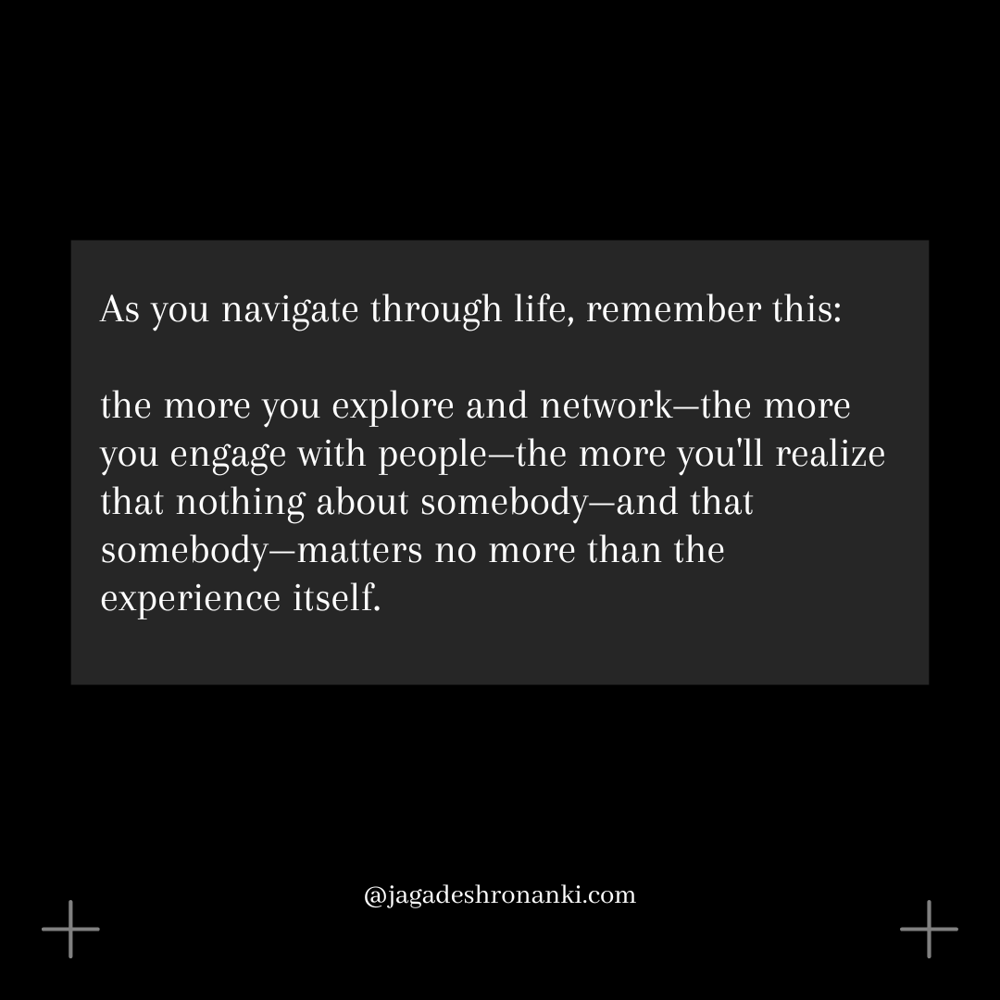

---

title: The Weight of Expectations (Why We Feel Alone in a Crowded World)
description: A reflective piece on the fleeting nature of connections and the weight of solitude.
date: 2024-10-27
tags: ["solitude", "overthinking"]
image: "./assets/the-weight-of-expectations/connections.png"
imageDark: "./assets/the-weight-of-expectations/connections-dark.png"
published: true
author: Jagadesh Ronanki
---

A Moment&nbsp;&nbsp;↩

Last night, as I sat down for dinner, a sudden downpour caught me off guard. I waited, hoping someone would offer an umbrella. Just as I was about to step outside, a stranger approached with one in hand. I grabbed it, said thank you, and walked into the rain. In that moment, I didn’t think about how this small act connected us. My purpose was simple: I wanted to get out of the restaurant, and they wanted to get in. We exchanged a prop that aided us both, and just like that, we were on our separate paths again. This experience made me reflect on how connections have changed over time. I can’t recall the face or tone of the person who helped me—yet here I am, sitting on my bed, contemplating their impact on my life. I remember countless small moments and people who shaped my journey. Yet now, no matter how hard I try, those fleeting exchanges seem to slip away into silence.

I started doubting:

**Does the other person think about it too?** 
**Is this a sign of selfishness?** 
**Is this how it’s meant to end?** 

As I think about these brief moments, I can’t help but wonder **what has changed** in how I see things. The connections that once felt strong and important now seem to fade away. The exchanges that used to mean something now feel shallow. 

> Back then, everything started with “thank you.”  
> Nothing ends with “sorry.” 
> But now, everything ends with “thank you,”  
> and everything ends with “sorry.” 

This shift leaves me questioning the depth of my interactions.

A Solitude&nbsp;&nbsp;↩

You may find that a single person, a specific incident, or just one moment can leave you feeling empty and broken. And then the chain of thoughts begins to creep in. 

You might replay the incident over and over in your mind, questioning what went wrong or how you could have acted differently. Each replay deepens the wound, feeding into a narrative that tells you you're not enough. 

Isolation creeps in quietly at first. You start to withdraw from friends and family, feeling as though they wouldn’t understand your pain. The laughter and joy of those around you become reminders of your own sadness. You might see others seemingly working to achieve while you feel stuck in a fog. 

Self-doubt makes you question your worth and place in the world. Thoughts like __“Why can’t I be happy like them?”__ or __“What’s wrong with me?”__ begin to dominate your mind. You may find yourself trapped in a cycle of negative self-talk, convincing yourself that you are unworthy of love or connection. The more you dwell on these feelings, the more isolated you become, creating a barrier between yourself and the outside world. 

A Moment of Truth&nbsp;&nbsp;↩

But what you fail to see is this: _The world doesn’t revolve around your thoughts, your feelings, or your personal struggles_. These emotions are yours alone—often insignificant in the grand scheme of things. It’s all you and the decisions you’ve made that have led you to this point. You’re the one who has allowed your life to stagnate; it’s time to face that truth. 

People are not reflecting on your actions; they’re too busy navigating their own chaos. This reality can be harsh, especially when you find yourself feeling isolated or misunderstood.

A Connection&nbsp;&nbsp;↩

As we grow older, we often romanticize relationships, believing that each connection carries profound meaning. When you’re young, every friendship feels vital; you invest emotionally in every encounter, convinced these bonds will last forever. However, as life unfolds, the reality becomes starkly different. People are preoccupied with their own struggles and ambitions; they may not have the bandwidth to consider your feelings deeply. This isn’t a reflection of your worth but rather a testament to the human condition. Everyone is juggling their own burdens; in this rush, it’s easy to overlook moments that matter to you.

When you place too much weight on these interactions, you set yourself up for disappointment. You expect others to recognize your efforts and emotions while failing to understand that most people are too consumed by their own lives to notice yours. You start questioning your value: “Why can’t I be happy like them?” or “What’s wrong with me?” These thoughts can spiral into negativity—a cycle where you convince yourself that you are unworthy of connection or love. It’s crucial to understand that these feelings are part of a larger pattern—one where personal growth often takes a backseat to external validation.

A Reality&nbsp;&nbsp;↩

  

Networking doesn’t always mean forming deep relationships; it simply means being around people. You don’t need to invest emotionally in every interaction; sometimes just sharing space with others can be enough. Life is a series of interactions rather than fixed relationships—you can begin to relieve yourself from emotional burdens by recognizing that every connection has its place but does not have to dictate your worth or happiness. 

__Believe me when I say:__ emptiness and confusion are part of your reality; escape is merely possible.

A Reassessment&nbsp;&nbsp;↩

And so I find myself back at those questions:

**Does the other person think about it too?** 
**Is this a sign of selfishness?** 
**Is this how it’s meant to end?** 

I realize now that I am overthinking—caught in a loop of doubt and reflection rather than moving forward. It’s time to let go of these burdensome thoughts. Let it not define me.

---

You are meant for more